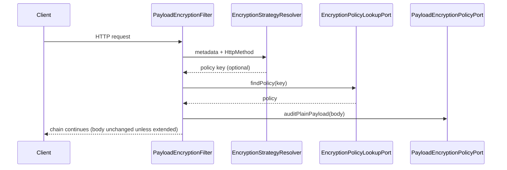

# Arquitectura hexagonal parcial del API Gateway

Este documento describe la organización del módulo `gateway`: capas **aplicación** e **infraestructura** (hexagonal / puertos y adaptadores), por qué **no** hay capa `domain`, y si la ubicación de filtros y políticas **respeta o rompe** la arquitectura.

---

## 1. Mapa mental: aplicación, dominio e infraestructura

En un backend “rico” suele hablarse de **dominio** (reglas de negocio), **aplicación** (casos de uso, orquestación) e **infraestructura** (HTTP, BD, mensajería, configuración Spring).

En **este** proyecto el producto es un **API Gateway**: el “negocio” es delgado (enrutar, auditar payload, correlación). Por eso:

| Capa clásica | En este repo |
|--------------|--------------|
| **Dominio** | No hay paquete `domain`: no hay entidades de negocio que justifiquen una capa propia. La regla útil (metadata + método → clave de política) vive en **aplicación** como servicio puro. |
| **Aplicación** | **`gateway.application`**: **puertos** (contratos) y **servicios** sin Spring/WebFlux. |
| **Infraestructura** | **`gateway.infrastructure`**: **`web`** (`GlobalFilter`, entrada al sistema), **`policy`** (adaptadores que implementan los puertos de auditoría de payload + lookup Spring), **`config`** (beans). |

Sigue siendo **hexagonal parcial** porque el motor es Spring Cloud Gateway; la intención es que los nombres de paquetes y clases sean **reconocibles** en una revisión.

### 1.1 ¿Está “bien” colocado todo? ¿Rompemos hexagonal?

**No se rompe la regla de dependencias** si se cumple: *infraestructura → aplicación* y **nunca** *aplicación → infraestructura*. Los puertos viven en `application.port`; las clases bajo `infrastructure` dependen de esos puertos y del servicio puro. `EncryptionStrategyResolver` no importa Spring: correcto.

**`infrastructure.web` (filtros):** en terminología hexagonal son **adaptadores primarios** o **puertos de entrada concretados en HTTP**: Spring Cloud Gateway expone el contrato `GlobalFilter`; nuestras clases son la implementación. Llamarlas **`*Filter`** alinea el nombre con el framework (`GlobalFilter`) y con lo que hacen; “WebAdapter” era correcto pero más genérico.

**`infrastructure.policy`:** aquí conviven dos tipos de adaptador secundario, y **ambos son válidos** en el mismo paquete acotado:

1. **`RsaOaepPayloadEncryptionPolicy` / `AesGcmPayloadEncryptionPolicy`** — implementan **`PayloadEncryptionPolicyPort`** (política técnica de auditoría, no “política de negocio” DDD). El nombre **Policy** está alineado con el **puerto** `PayloadEncryptionPolicyPort`.
2. **`SpringEncryptionPolicyLookup`** — implementa **`EncryptionPolicyLookupPort`**. No es una “policy” criptográfica; es **descubrimiento de implementaciones** vía Spring. Mantenerlo en el mismo paquete `policy` es una decisión de **módulo funcional** (“todo lo relacionado con resolver y ejecutar políticas de payload en infra”). Si creciera el código, se podría separar en `infrastructure.policy.lookup` sin cambiar puertos.

**`GatewayConfiguration`:** solo registra beans de aplicación (p. ej. el resolver puro). No hace falta el sufijo “Hexagonal” en el nombre de la clase: la ubicación (`infrastructure.config`) ya indica que es **ensamblaje** infraestructura.

**Matiz (no es violación, es pragmatismo):** filtros como `PayloadEncryptionFilter` inyectan **`EncryptionStrategyResolver`** directamente. En un hexágono muy estricto podrías exponer un único **caso de uso** en aplicación (p. ej. `AuditPayloadForExchange`) y que el filtro solo lo invoque. Aquí el filtro hace de **orquestador delgado**; el resolver sigue siendo lógica de aplicación testeable. Es aceptable para un gateway.

**Evolución futura (rutas dinámicas, BD):** un puerto tipo `RouteCatalogPort` en `application` y adaptadores en `infrastructure` (p. ej. `persistence` o `RouteDefinitionRepository`). Actualizar la ruta en la frase: `infrastructure.persistence` o similar, no hace falta el segmento `output` en el nombre del paquete.

---

## 2. Estructura de carpetas (paquetes)

```
com.ezamora.api_gateway_v1/
├── ApiGatewayV1Application.java
│
├── gateway/
│   ├── application/
│   │   ├── port/
│   │   │   ├── PayloadEncryptionPolicyPort.java
│   │   │   └── EncryptionPolicyLookupPort.java
│   │   ├── support/
│   │   │   └── GatewayRouteMetadata.java
│   │   └── service/
│   │       └── EncryptionStrategyResolver.java
│   │
│   └── infrastructure/
│       ├── config/
│       │   └── GatewayConfiguration.java          ← beans (resolver sin @Component en la clase)
│       ├── web/                                   ← GlobalFilter (adaptadores primarios)
│       │   ├── RequestIdFilter.java
│       │   ├── MatchedGatewayRouteLoggingFilter.java
│       │   └── PayloadEncryptionFilter.java
│       └── policy/                                ← adaptadores secundarios (puertos de payload)
│           ├── SpringEncryptionPolicyLookup.java
│           ├── RsaOaepPayloadEncryptionPolicy.java
│           └── AesGcmPayloadEncryptionPolicy.java
```

No hay `package-info.java` en `gateway`: la descripción queda aquí y en **`GATEWAY_REPLICATION_PROMPT.md`**.

---

## 3. Puertos (`application.port`)

| Puerto | Rol |
|--------|-----|
| `PayloadEncryptionPolicyPort` | `policyKey()` (YAML) y `auditPlainPayload(byte[])`. |
| `EncryptionPolicyLookupPort` | `Optional<PayloadEncryptionPolicyPort>` por clave. |

---

## 4. Servicios y soporte (`application`)

| Elemento | Responsabilidad |
|----------|-----------------|
| `GatewayRouteMetadata` | Constantes `ROUTE_STRATEGY`, `STRATEGY_BY_METHOD`. |
| `EncryptionStrategyResolver` | Clase **final**, **sin Spring**: metadata + `HttpMethod` → clave de política. |

---

## 5. Infraestructura

### 5.1 Web — `GlobalFilter` (`infrastructure.web`)

| Clase | Orden | Función |
|-------|--------|---------|
| `RequestIdFilter` | `HIGHEST_PRECEDENCE` | `X-Request-ID`, logs y duración. |
| `MatchedGatewayRouteLoggingFilter` | `HIGHEST_PRECEDENCE + 5` | Ruta, upstream, política efectiva, método, path. |
| `PayloadEncryptionFilter` | `HIGHEST_PRECEDENCE + 20` | Body, resolver + lookup, auditoría, reenvío del body. |

### 5.2 Políticas y lookup (`infrastructure.policy`)

| Clase | Rol |
|-------|-----|
| `RsaOaepPayloadEncryptionPolicy`, `AesGcmPayloadEncryptionPolicy` | `@Component` → `PayloadEncryptionPolicyPort`. |
| `SpringEncryptionPolicyLookup` | `@Component` → `EncryptionPolicyLookupPort`. |

### 5.3 Configuración (`infrastructure.config`)

| Clase | Rol |
|-------|-----|
| `GatewayConfiguration` | `@Bean EncryptionStrategyResolver`. |

---

## 6. Flujo resumido (auditoría de payload)



---

## 7. Cómo extender

**Nueva política:** clase en `infrastructure.policy`, implementa `PayloadEncryptionPolicyPort`, `@Component`, `policyKey()` único, referencia en `metadata` de la ruta.

**Nuevo filtro global:** clase en `infrastructure.web`, `GlobalFilter` + `Ordered`.

---

## 8. Relación con el patrón Strategy (GoF)

- Política = **puerto** (`PayloadEncryptionPolicyPort`).
- Resolución = **`EncryptionStrategyResolver`** + **`EncryptionPolicyLookupPort`** (implementación en infraestructura).
- Orquestación HTTP = **`PayloadEncryptionFilter`**.

---

## 9. Documentación relacionada

**`GATEWAY_REPLICATION_PROMPT.md`**: réplica, variables de entorno, prompt en inglés.
